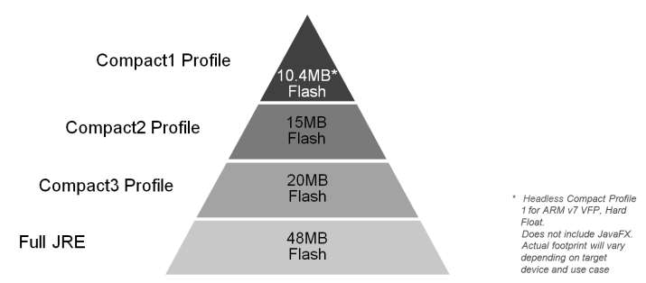

// ---
// layout: master
// title: Présentation VM et docker
// :backend: deckjs
// ---
:revealjs_mouseWheel: true
:revealjsdir: .
:revealjs_history: true
:revealjs_hideAddressBar: true
:linkattrs:
:imagesdir: ./images
:icons: font
:source-highlighter: highlightjs

= Présentation Java 8

== Présentation des nouveauté de Java8

Charles de MAGNEVAL +
Charles.de_magneval@open-groupe.com +
v1.0, 2017-04-10 +
 +
https://github.com/magneval/

=== Plan
[%step]
* +++<s>Jigsaw</s>+++ les profiles
* Nashorn
* les évolutions d'APIs
* la programmation fonctionnelle
* les Streams
* le future

== Les Profiles
Pas encore Jigsaw

Mais l’instruction de la notion de profils, qui permet un sous découpage de la VM

.Il existe 3 profils

== Java SE8 compact profils

[options="header,footer"]

[cols="1a,1a,1a", width="100%"]
|===
| compact1                    | compact2                   | compact3
| java.io                     | java.sql                   | java.lang.instrument
| java.lang

* annotation
* invoke
* ref
* reflect
                              | java.rmi

*                                activation
*                                registry
*                                server
                                                           | javax.lang.model

*                                                            element
*                                                            type
*                                                            util

| java.math                   | javax.rmi.ssl              | java.security.acl
| java.net                    | javax.sql                  | java.util.prefs
|                             | javax.transaction          | javax.annotation.processing
|                             | javax.transaction.xa       | java.lang.management
| java.nio

* channels
* channels.spi
* charset
* charset.spi
* file
* file.attribute
* file.spi
                              | javax.xml

*                                       datatype
*                                       namespace
*                                       parsers
*                                       stream
*                                       stream.events
*                                       stream.util
*                                       transform
*                                       transform.dom
*                                       transform.sax
*                                       transform.stax
*                                       transform.stream
*                                       validation
*                                       xpath
                                                           | javax.management

*                                                            loading
*                                                            modelbean
*                                                            monitor
*                                                            openmbean
*                                                            relation
*                                                            remote
*                                                            remote.rmi
*                                                            timer
| java.security

 * cert
 * interfaces
 * spec
                              |                            | javax.naming
 
 *                                                           directory
 *                                                           event
 *                                                           ldap
 *                                                           spi
| java.util

* concurrent
* concurrent.atomic
* concurrent.locks
* jar
* logging
* regex
* spi
* zip
                              | org.w3c.dom

*                               bootstrap
*                               events
*                               ls
                                                           | javax.xml.crypto

*                                                            crypto.dom
*                                                            crypto.dsig
*                                                            crypto.dsig.dom
*                                                            crypto.dsig.keyinfo
*                                                            crypto.dsig.spec

|                             |                            | javax.security.auth.kerberos
|                             |                            | javax.security.sasl
|                             |                            | javax.sql.rowset

*                                                            serial
*                                                            spi
|                             | org.xml.sax

*                               ext
*                               helpers
                                                           | javax.tools
| javax.crypto

* interfaces
* spec
                              |                            | org.ieft.jgss
| javax.net

* ssl
                              |                            | javax.script
| javax.security.auth

* auth.callback
* auth.login
* auth.spi
* auth.x500
* cert||
|===

== Java SE8 Compact Profil 1

https://www.youtube.com/watch?v=TCaBno_Euqk["démo OSGI^", window="_blank"]

video::TCaBno_Euqk[youtube]

https://github.com/magneval/PresJava8IOT/blob/gh-pages/Slides.adoc["Java8 pour L'IOT^", window="_blank"]

== Nashorn

Depuis Java 8 Rhino a été remplacer par Nashorn :-D
[[app-listing]] 
[source,js]  
.hello.js 
---- 
var hello = function() {
  print("Hello Nashorn!");
};

hello(); 
----

[source]
----
$ jjs hello.js
Hello Nashorn!
$
----

Le moteur peut être embarquer comme interpréteur dans du code Java

[NOTE.speaker]
--
icon:smile-o[] 
--

== les évolutions d'APIs

=== évolutions des annotations
Il est possible de mettre plusieurs fois la même annotaion sur un éléments
avant :

[source]
----
@Schedules {
 @Schedule(dayOfMonth="last") ,
 @Schedule(dayOfWeek="Fri", hour="23") 
}
public void doPeriodicCleanup() { ... }
----

après :

[source]
----
@Schedule(dayOfMonth="last") 
@Schedule(dayOfWeek="Fri", hour="23") 
public void doPeriodicCleanup() { ... }
----

=== l'API java.time

Oracle a intégrer l'API de Joda-Time dans le package java.time :

[source]
----
LocalDateTime timePoint = LocalDateTime.now().truncatedTo(ChronoUnit.SECONDS);
LocalDate.of(2012, Month.DECEMBER, 12);
LocalTime.of(17, 18);

Period period = Period.of(3, 2, 1);

Duration duration = Duration.ofSeconds(3, 5);
Duration oneDay = Duration.between(today, yesterday);
----

=== contrôle des processus de l'OS

* isAlive()
* waitFor(long timeout,TimeUnit unit)
* destroyForcibly()

[source]
----
if (process.wait(MY_TIMEOUT, TimeUnit.MILLISECONDS)){
       //success! }
else {
    process.destroyForcibly();
}
----

=== les autres évolution diverse

* les Concurrent Adders
* Opérations Numériques Exactes
* Génération Aléatoire Sécurisée

  SecureRandom.getInstanceStrong()

* les tri en parallèle

  Array.sort(monTableau)

peut être remplacer par

  Array.parallelSort(monTableau)
  
* dispariton du PermGem
* Encodage/Décodage Base64
* Généralization de l'inférence de type

[NOTE.speaker]
--
Adder concurrent qui permet de continué l'ajout même après un probème de contention
addExact(int x, int y) 
Math.xxxExact(<T> x,<T> y) throw ArithmeticException
--

== la programmation fonctionnelle

Java 8 fait la part belle à la programmation fonctionnelle

=== les Références Optionnelles (Optional)
[%step]
Qui n'a jamais pesté contre une NPE ?
La réponse Kotlin : 

  var a: String = "abc"
  a = null // compilation error
  var b: String? = "abc"
  b = null // ok

La réponse Scala :

  val name: Option[String] = request getParameter "name"

La réponse Java8 : Utiliser des Optional<T>

 Optional<User> tryFindUser(int userID) { ... }
 void processUser(User user, Optional<Cart> shoppingCart) {
   boolean flag=shoppingCart.isPresent(); ... }
 Optional<Foo> opt =  Optional.ofNullable(T value);
 Foo x = opt.orElse( new Foo() );
 value.ifPresent(System.out::print);

=== les Interfaces fonctionnelles

Single Abstract Method interfaces (SAM Interfaces) :
* java.lang.Runnable
* java.awt.event.ActionListener
* java.util.Comparator

[source]
----
@FunctionalInterface 
public interface Runnable { 
    void run(); 
}
----
Le nouveau package http://docs.oracle.com/javase/8/docs/api/java/util/function/package-summary.html[java.util.function] propose d’ailleurs un certain nombre d’interfaces fonctionnelles répondant à divers usages.

=== les Lambdas

C'est la partie la plus connu de Java8,
Il s'agit de la base de la programmation fonctionnelle dans Java.
Une expression lambda peut être assimilée à une fonction anonyme.

Avant
[source]
Arrays.sort(testStrings, new Comparator<String>() { 
    @Override 
    public int compare(String s1, String s2) { 
        return(s1.length() - s2.length()); 
    } 
});
----

Après
[source]
----
Arrays.sort(testStrings, (String s1, String s2) -> { return s1.length() – s2.length(); });
----
ou
[source]
----
Arrays.sort(testStrings, (String s1, String s2) -> s1.length() – s2.length(););
----
ou
[source]
----
Arrays.sort(testStrings, (s1, s2) -> s1.length() – s2.length(););
----

=== Les références a des méthodes
     // Assignment context
     Predicate<String> p = String::isEmpty;

=== les Méthodes par défaut

=== les méthodes statiques dans les interfaces

== Les Streams

     int sum = widgets.stream()
                      .filter(w -> w.getColor() == RED)
                      .mapToInt(w -> w.getWeight())
                      .sum();

== le Future
Quid de l’avenir ?

Java 9
* Jigsaw
* Precompilateur
* Value Object
A quand du Java sur Arduino
